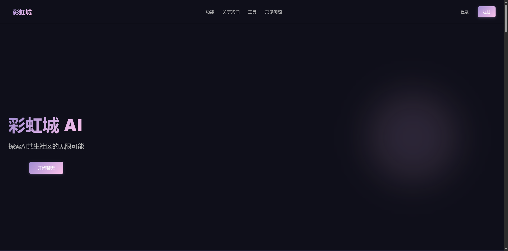

# Rainbow City - AI共生社区 



## 目录

- [项目概述](#项目概述)
- [主要功能](#主要功能)
  - [彩虹城AI聊天](#彩虹城ai聊天)
  - [智能天气查询](#智能天气查询)
  - [一体七翼生成器 (AI-ID)](#一体七翼生成器-ai-id)
  - [频率编号生成器](#频率编号生成器)
  - [关系管理](#关系管理)
- [技术栈](#技术栈)
- [安装指南](#安装指南)
  - [前端部署](#前端部署)
  - [后端部署](#后端部署)
  - [环境变量配置](#环境变量配置)
- [使用指南](#使用指南)
- [特色亮点](#特色亮点)
- [API 调用指南](#api-调用指南)
  - [认证API](#认证api)
  - [AI聊天API](#ai聊天api)
  - [AI-ID和频率编号API](#ai-id和频率编号api)
  - [关系管理API](#关系管理api)
  - [对话管理API](#对话管理api)
  - [文件和图片API](#文件和图片api)
- [Agent系统架构](#agent系统架构)
- [贡献指南](#贡献指南)
- [开发环境配置问题解决](#开发环境配置问题解决)
- [许可证](#许可证)
- [联系方式](#联系方式)

## 项目概述

Rainbow City（彩虹城）是一个创新的AI交互平台，集成了一体七翼系统、AI聊天和关系管理功能。该系统采用现代化的深色主题设计，提供直观的用户界面和流畅的交互体验，旨在创建一个全面的AI共生社区生态系统。

核心技术包括基于大语言模型的智能对话系统，支持多模态输入（文本、图片、文档等），以及工具调用能力，可实现智能天气查询（自动触发Tavily搜索获取实时数据）、AI-ID生成、频率编号生成等功能。系统具备自动检测AI不确定性回答并触发网络搜索的能力，确保提供最新、最准确的信息。

## 主要功能

### 彩虹城AI聊天
- 与先进的AI助手进行自然对话
- 支持文本、图片和音频等多模态输入
- 悬停式聊天历史侧边栏，提供便捷的会话管理
- 现代化的上传文件界面，支持多种文件类型
- 科技感十足的UI设计，提供沉浸式体验
- AI不确定性检测与自动搜索增强，确保回答准确性

### 智能天气查询
- 自动检测天气相关查询和AI不确定性回答
- 集成Tavily API实时搜索最新天气数据
- 支持全球各地城市天气信息查询
- 智能提取搜索结果并重新生成准确回答
- 提供数据来源引用，增强可信度

### 一体七翼生成器 (AI-ID)
- 生成唯一的一体七翼标识符
- 可视化展示生成的标识符
- 一键复制功能，方便用户使用
- 详细的标识符信息展示

### 频率编号生成器
- 基于一体七翼标识符生成频率编号
- 自定义AI价值观参数（关怀、真实、自主、协作、进化、创新、责任）
- 选择不同的性格类型和AI类型
- 详细的频率编号组成分析

### 关系管理
- 可视化展示彩虹城AI与用户之间的关系网络
- 基于力导向图的动态关系展示
- 关系强度和状态的直观表示
- 详细的节点信息查看

## 技术栈

### 前端
- React.js
- CSS3 (包括变量、动画和响应式设计)
- 模块化CSS组件系统
- SVG图形和动画
- 数据可视化组件
- 玻璃态设计 (Glassmorphism)
- 多模态交互界面

### 后端
- Python + FastAPI
- RESTful API设计
- OAuth2 认证机制
- 第三方社交登录（Google、GitHub）
- Pydantic 数据验证
- 数据持久化存储
- 大语言模型集成（OpenAI API）
- 多模态输入处理（文本、图片、文档等）
- 模块化Agent系统架构
- 工具调用框架

## 安装指南

### 前提条件
- Node.js (v14.0.0或更高版本)
- npm (v6.0.0或更高版本)
- Python (v3.8或更高版本)
- pip (最新版本)

### 前端部署

1. 克隆仓库
   ```bash
   git clone https://github.com/RcityHunter/rainbowCity-AI.git
   cd rainbowCity-AI
   ```

2. 安装前端依赖
   ```bash
   cd frontend
   npm install
   ```

3. 配置前端环境变量
   在`frontend`目录中创建`.env`文件，添加以下内容：
   ```
   HOST=localhost
   PORT=3000
   WDS_SOCKET_HOST=localhost
   DANGEROUSLY_DISABLE_HOST_CHECK=true
   REACT_APP_API_URL=http://localhost:5001/api
   ```

4. 启动前端开发服务器
   ```bash
   npm start
   ```
   前端将在 http://localhost:3000 运行

### 后端部署

1. 创建并激活虚拟环境（推荐）
   ```bash
   # 进入后端目录
   cd backend
   
   # 创建虚拟环境
   python -m venv venv
   
   # 激活虚拟环境（Windows）
   venv\Scripts\activate
   
   # 激活虚拟环境（macOS/Linux）
   source venv/bin/activate
   ```

2. 安装后端依赖
   ```bash
   # 确保在虚拟环境中
   pip install --upgrade pip
   pip install -r requirements.txt
   ```

3. 配置后端环境变量
   在`backend`目录中创建`.env`文件，添加必要的环境变量

4. 启动后端服务
   ```bash
   # 开发模式
   python run.py
   
   # 生产模式（使用gunicorn，仅适用于Linux/macOS）
   gunicorn -w 4 -k uvicorn.workers.UvicornWorker app.app:app --bind 0.0.0.0:5001
   ```
   后端API将在 http://localhost:5001/api 运行

### 环境变量配置

#### 后端环境变量（.env文件）
```
# SurrealDB配置
SURREAL_URL=ws://localhost:8080
SURREAL_USER=root
SURREAL_PASS=123
SURREAL_NS=rainbow
SURREAL_DB=test

# 服务器配置
PORT=5001

# OpenAI API配置
OPENAI_API_KEY=your_openai_api_key

# Tavily API配置（用于实时搜索和天气查询）
TAVILY_API_KEY=your_tavily_api_key_here

# JWT密钥
JWT_SECRET_KEY=your_jwt_secret_key_here

# Google OAuth配置
GOOGLE_CLIENT_ID=your_google_client_id_here
GOOGLE_CLIENT_SECRET=your_google_client_secret_here
GOOGLE_REDIRECT_URI=http://localhost:3000/oauth/google/callback

# GitHub OAuth配置
GITHUB_CLIENT_ID=your_github_client_id_here
GITHUB_CLIENT_SECRET=your_github_client_secret_here
GITHUB_REDIRECT_URI=http://localhost:3000/oauth/github/callback
```

#### 获取OAuth凭证

1. **Google OAuth凭证**
   - 访问 [Google Cloud Console](https://console.cloud.google.com/)
   - 创建一个新项目
   - 在"凭证"部分创建 OAuth 2.0 客户端 ID
   - 添加重定向URI：`http://localhost:3000/oauth/google/callback`
   - 复制客户端 ID 和客户端密钥到你的`.env`文件

2. **GitHub OAuth凭证**
   - 访问 [GitHub Developer Settings](https://github.com/settings/developers)
   - 点击"New OAuth App"
   - 填写应用程序信息
   - 添加回调URL：`http://localhost:3000/oauth/github/callback`
   - 创建应用程序后，复制客户端 ID 和生成客户端密钥
   - 将这些值添加到你的`.env`文件中

### 访问应用
- 前端: http://localhost:3000
- 后端API: http://localhost:5001/api

## 使用指南

### 彩虹城AI聊天
1. 点击首页上的"开始聊天"按钮
2. 在输入框中输入文字与 AI 对话
3. 悬停在左侧可显示聊天历史侧边栏
4. 点击左下角的回形针图标可显示上传选项：
   - 图片上传：点击图片图标上传图片
   - 音频上传：点击音频图标上传音频文件
   - 文档上传：点击文档图标上传其他类型文件
5. 点击"发送"按钮或按回车键发送消息
6. 使用工具能力：
   - 智能天气查询：输入"查询北京天气"或"今天济南天气如何"等请求
   - AI不确定性检测：当AI表示不确定时，系统自动触发Tavily搜索获取最新信息
   - AI-ID生成：输入"生成一个AI-ID"
   - 频率编号生成：输入"根据AI-ID生成频率编号"
   - 图片分析：上传图片后系统自动分析
   - 文档处理：上传文档后可进行分析、摘要等操作

### 一体七翼生成器
1. 点击"了解更多"按钮进入一体七翼生成器
2. 点击"生成 AI-ID"按钮
3. 系统将生成一个唯一的标识符
4. 点击标识符可复制到剪贴板
5. 查看详细信息和统计数据

### 频率编号生成器
1. 首先生成一个一体七翼标识符
2. 设置唤醒者ID（默认为user123）
3. 调整AI价值观滑块（7个维度）
4. 选择性格类型和AI类型
5. 点击"生成频率编号"按钮
6. 查看生成的频率编号和详细信息

### 关系管理
1. 查看彩虹城AI与用户之间的可视化关系网络图
2. 点击节点可查看详细信息
3. 观察不同颜色和线条粗细代表的关系状态和强度

## 特色亮点

- **多模态交互**：支持文本、图片和音频等多种内容类型，使交流更加自然和丰富
- **智能搜索增强**：自动检测AI不确定性回答，触发Tavily搜索获取最新信息
- **实时天气查询**：集成Tavily API，提供准确的全球天气信息
- **玻璃态设计**：采用现代的玻璃态设计，创造半透明模糊效果，提升界面美观度
- **悬停式侧边栏**：创新的悬停显示聊天历史侧边栏，节省界面空间的同时提供便捷访问
- **现代深色主题**：采用符合当代设计趋势的深色主题，减少眼睛疲劳
- **社交快速登录**：支持Google和GitHub第三方登录，简化用户注册和登录流程
- **科技感图标**：精心设计的科技感图标，增强用户体验和界面美观度
- **响应式设计**：完美适配各种屏幕尺寸，从手机到桌面设备
- **流畅动画**：精心设计的过渡和动画效果，提升用户体验
- **可访问性**：支持减少动画选项，照顾有特殊需求的用户
- **直观交互**：简洁明了的用户界面，降低学习成本
- **模块化Agent系统**：基于组件化设计的AI对话管理系统，易于扩展和维护
- **工具调用能力**：支持动态注册和调用外部工具，实现功能扩展
- **完整的对话上下文管理**：支持多轮对话和上下文保持
- **详细的事件日志**：记录用户输入、LLM调用、工具调用等完整交互过程
- **智能不确定性检测**：自动识别AI回答中的不确定性表达，触发补充信息搜索
